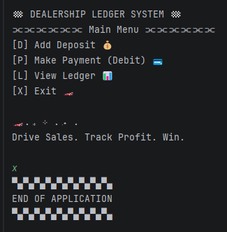
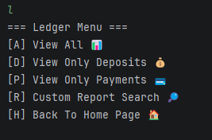

# Dealership Ledger System

## About This Project

I built this application as part of my transition into software development, with a focus on creating something practical and easy to use.

Coming from a background in data center infrastructure and technical operations, I’ve always worked in environments where accuracy, organization, and efficiency matter. This project reflects that mindset—applied to software.

The idea behind it is simple: a dealership-style ledger that tracks revenue, expenses, and financial activity in a clear and structured way.

---

## What It Does

This is a console-based Java application that allows you to:

- Record sales (revenue) 💰 
- Record expenses (inventory, repairs, fees) 💳 
- View a full transaction ledger 
- Filter transactions by type 
- Run financial reports (monthly, yearly, vendor search)

All data is stored in a CSV file and loaded into memory for processing.

---

## Screenshots

### Main Menu

### Ledger Menu

### Reports Menu
<!-- Insert screenshot here -->
Reports Menu

---

## Biggest Challenge

The biggest challenge was designing the application so it had a clean flow and felt intuitive to use, without overcomplicating the codebase.

I focused on:
- Keeping navigation simple and consistent 
- Making sure each menu had a clear purpose 
- Avoiding unnecessary complexity while still delivering useful functionality 

That balance—between usability and simplicity—was the most important part of the build.

---

## Key Focus Areas

- File input/output using CSV files 
- Data handling with ArrayList 
- Working with LocalDate and LocalTime 
- Sorting and filtering transaction data 
- Structuring a multi-menu console application 

---

## How to Run It

1. Open the project in IntelliJ or VS Code 
2. Ensure the file exists:
src/main/resources/transactions.csv 
3. Run:
AutoLedgerApp.java 

---

## Current Features

- Add and store transactions 
- View full ledger history 
- Filter by sales or expenses 
- Monthly and yearly reporting 
- Vendor-based search 

---

## Future Improvements

- Profit/loss calculations 📊 
- Stronger input validation 
- Enhanced reporting (trends, summaries) 
- UI upgrade (JavaFX or web-based) 
- Database integration 

---

## About Me

I have a background in construction, data center operations, and IT, with experience in systems, infrastructure, and security. I’m currently focused on expanding into software engineering and building applications that solve real problems.

---

## Final Note

This project highlights my ability to take a concept, structure it effectively, and build a working solution with a clear user experience.

It’s a strong foundation that I plan to continue building on 🚀